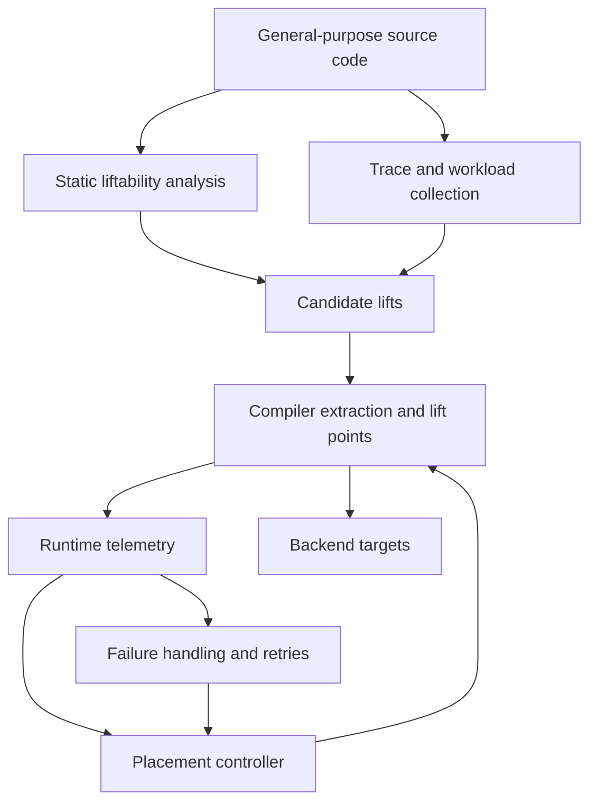

# Monolift Research Landscape and Recommended Agenda

## Executive Summary

The attached brief is strategically well framed. It correctly centers Monolift around six “load-bearing” claims and four fault lines: annotation versus automation, state and correctness, placement as a runtime decision problem, and portability beyond Go plus Kubernetes. Those really are the places where Monolift will either become a durable research program or collapse into “yet another decomposition tool.” fileciteturn0file0L13-L31

After checking the public Monolift paper against the adjacent literature, the strongest defensible novelty is **not** single-source distributed programming by itself. That territory is already well populated by multitier, tierless, and choreographic systems such as Ur/Web, ScalaLoci, and Pirouette. Monolift’s sharper contribution is a **low-commitment, compiler-mediated distribution model**: additive annotations in a general-purpose language, reversibility back to an ordinary monolith, and runtime-selectable local versus remote dispatch over extracted computation. That combination is meaningfully different from prior systems that require adopting a new language, actor framework, or component model up front. citeturn14view2turn24view0turn24view1turn24view2turn24view3

The brief is also right that Monolift is currently thinnest exactly where the literature is strongest: a principled notion of what is safe to lift, a failure model for local/remote calls, and a stable runtime control model for delegate expressions. The public paper itself says that composing delegate expressions into a global transition function is challenging, and the current prototype DSL is threshold based. Its published evaluation is still narrow: one DeathStarBench Social Network port, static decomposition comparisons on an eight-node Kubernetes cluster, and one dynamic policy experiment that improves tail latency by about 20% relative to a microservice baseline for that workload. citeturn14view1turn20view2turn15view3turn20view1

The highest-value near-term sequence is therefore: **first**, formalize liftability and failure semantics; **second**, replace threshold rules with an explicit control loop or learning-based placement model; **third**, measure real annotation and refactoring burden on external codebases; **fourth**, only then invest heavily in retargetable backends such as Knative, Lambda, or Wasm. That ordering is supported by the state-safety literature, the resource-control literature, and the adoption lesson from entity["company","Google","internet company"]’s Service Weaver, which reported strong technical results but later moved to maintenance mode because direct adoption required rewriting large parts of existing applications. citeturn13view0turn13view1turn25view4turn29view3turn17view0turn23view2turn23view1

## Extracted Questions and Assumptions

The brief’s explicit purpose is to map the landscape around Monolift, determine what is genuinely novel, identify the strongest prior art for each subproblem, and sketch concrete next directions. It is written for the Monolift research team and assumes prior reading of the Monolift PLOS paper. It does **not** specify timeline, budget, or geographic constraints, so this report assumes none. fileciteturn0file0L3-L9 fileciteturn0file0L1-L491

The concise set of research questions extracted from the brief is:

- **Where is the real novelty?** Is Monolift genuinely new relative to multitier programming, choreographic programming, actor systems, distributed objects, and compiler-driven partitioning? fileciteturn0file0L35-L63
- **How much annotation can be inferred?** How far can static analysis, profiling, and trace-driven methods reduce manual `offload` annotations? fileciteturn0file0L24-L31
- **What is a liftable function or interface?** What static conditions make extraction sound, especially under the current “no shared global state” model? fileciteturn0file0L213-L239
- **How should placement be decided online?** What formal model should compose delegate expressions into a stable, workload-aware transition function? fileciteturn0file0L155-L180
- **What are the failure semantics of a lift call?** What happens under timeout, retry, partial deployment, rolling upgrade, or placement transitions? fileciteturn0file0L308-L329
- **How portable is the abstraction?** Can the model survive translation from Go and Kubernetes to SSA-based tooling, Rust, Wasm, serverless, or edge runtimes? fileciteturn0file0L264-L289 fileciteturn0file0L356-L370
- **What is the actual adoption cost?** How much code surgery, state refactoring, and developer friction are hidden behind the “pay-as-you-go” claim? fileciteturn0file0L333-L352

The brief also bakes in several assumptions that deserve to be made explicit in any future paper draft. The most important are that annotations remain transparent outside Monolift, the application still runs as a monolith without the Monolift compiler, and lifts do not share global state with the rest of the application. Those assumptions are not incidental; they are the design center. fileciteturn0file0L15-L23 citeturn14view2turn14view3

My prioritized subtopics are, in order: **state/failure/correctness**, **placement/control/annotation synthesis**, **programming-model positioning and semantics**, and **retargetable backends plus adoption instrumentation**. I rank them that way because the paper already demonstrates artifact extraction and one dynamic-placement example, but the hardest unresolved claims are the ones that decide whether the model is sound, stable, and usable on real code. citeturn20view1turn14view1turn14view3turn23view2

The dependency structure suggested by the literature looks like this. citeturn12view3turn17view0turn12view2turn29view0

The main implication is that better placement alone will not rescue Monolift. Placement quality is downstream of liftability analysis, telemetry quality, and explicit failure semantics. That is why the brief’s four fault lines are not independent research threads; they are coupled. fileciteturn0file0L24-L31 citeturn12view2turn29view0turn17view0

## Programming Model and Compiler Semantics

The closest academic neighborhood is still multitier and tierless programming. Ur/Web compiles a unified, statically typed source program into the web’s distributed target languages as needed. ScalaLoci argues that multitier programming can support arbitrary distributed architectures while abstracting over low-level communication, serialization, and data conversion. The broader survey literature treats placement, communication, and consistency as recurring design axes rather than as one-off implementation decisions. That means Monolift should not claim to have discovered “single program, many tiers”; that battle was won long ago. citeturn24view2turn24view0turn0search1

Choreographic programming is even more relevant than the brief suggests. The key ECOOP paper explicitly argues that choreographic and multitier languages are “surprisingly similar” and gives translations between them. Pirouette then shows the more ambitious version of the idea: programmers write a centralized functional program, the compiler performs endpoint projection into endpoint code, message-type soundness implies deadlock freedom, and the results are verified in Coq. If Monolift can recast lift extraction as a form of endpoint projection, it inherits a much clearer semantic vocabulary than it currently has. citeturn24view1turn24view3

Where Monolift *is* different is incrementality and reversibility. The public paper states that annotations are transparent outside Monolift and that the original application still works unchanged without the compiler. That is a real distinction from multitier languages and from framework-heavy systems such as Service Weaver, which ask the developer to structure the code around components up front. The Monolift paper is therefore strongest when it describes itself as a **compiler pass over an existing application**, not as a new programming model ex nihilo. citeturn14view2turn20view0turn23view0

At the same time, Monolift should engage much more directly with Waldo’s classic argument that remote and local calls are fundamentally different because latency, memory, concurrency, and partial failure are different. The critique of remote transparency was one of the central lessons of distributed object systems, and Henning’s CORBA retrospective is the corresponding industrial cautionary tale about complexity and false abstractions. Monolift’s answer should not be “distribution is transparent.” Its answer should be: **a lift point is an explicit, developer-opted distribution boundary whose semantics are controlled and inspectable**. That framing is much more credible. citeturn33search0turn33search1

The best semantic next move is to define a small core calculus with lift annotations, endpoint projection, and a parameterized fault model. Verdi is useful here not because Monolift should become fully machine-verified tomorrow, but because Verdi shows how distributed-system reasoning gets much easier when the fault model is explicit and compositional. A theorem as modest as preservation of terminating behavior under a crash-stop, at-most-once model would already make Monolift’s academic position much stronger. citeturn29view2turn24view3turn24view1

## Automated Partitioning and Placement

The partitioning literature already covers most of the space that Monolift will inevitably be compared to. Coign used scenario-based profiling and graph cutting to repartition binary COM applications automatically. entity["company","Microsoft","technology company"] MAUI used fine-grained code offload plus a 0-1 integer linear program and reported order-of-magnitude energy savings for one application. CloneCloud combined static analysis with dynamic profiling and runtime migration. Pyxis profiled dependencies and server load to minimize control transfers and data transfer volume, reporting up to 3× lower latency and 1.7× higher throughput versus a non-partitioned implementation. citeturn25view1turn25view0turn26search0turn25view2

The more recent decomposition literature strengthens the same point. entity["company","IBM","technology company"] Mono2Micro uses static metadata plus runtime traces from business use cases to generate partition recommendations and then helps transform the result into deployable services. That is especially relevant because it is closer than MAUI or CloneCloud to Monolift’s likely users: teams sitting on large legacy applications, not green-field distributed programs. The implication is simple: Monolift should avoid broad novelty claims around “finding pieces of a monolith that might run elsewhere.” It should narrow the claim to **preserving a runnable monolith while extracting selectively controllable lift points**. citeturn12view5turn11search20

Placement control is the area where Monolift can still make a genuinely new systems contribution. The paper says the runtime should formulate a state transition model and derive a transition function from delegate expressions, but it also admits that composition is hard. The current delegate DSL is threshold based. That is a useful prototype, but it is not yet a control model. MAPE-K remains the cleanest architectural vocabulary for this kind of runtime loop, and Cilantro is the most directly applicable modern reference because it explicitly learns resource-to-performance mappings online and improves cluster-level objectives using real feedback rather than surrogate metrics alone. citeturn14view1turn20view2turn17view0turn17view1

The quantitative prior art here is strong enough to justify ambition. Cilantro reports 1.2–3.7× utility improvements across several scheduling objectives and, in a microservice setting, reduces end-to-end P99 latency to 0.57× the next best baseline. That is the right benchmark standard for Monolift’s control plane: not “did a threshold help once,” but “did an explicit controller reliably beat static decomposition and simpler reactive policies across workloads.” citeturn17view1

My recommended technical formulation is: use SSA-level static analysis to produce a ranked set of **candidate** lifts, use traces to estimate call frequency and data-movement cost, and then view each feasible placement configuration as an arm in a bandit or model-based controller optimized for an explicit SLO. The Go SSA package is already designed for source-level analysis tooling, and Mono2Micro plus Coign show what profile- and trace-guided candidate generation can look like in practice. citeturn12view3turn12view5turn25view1

## State, Failure Semantics, and Correctness

This is the most important unresolved section of the project. Monolift explicitly excludes lifts that share global state with the rest of the application because synchronizing that state would require expensive distributed algorithms. That design choice is reasonable for a first paper, but it is also the strongest limiter on adoption, because real monoliths are full of latent state dependencies that developers may not even recognize until they try to extract code. The public paper predicts that the required code changes will be minor; the literature does not yet justify that optimism. citeturn14view3

The best route to a principled “liftability” story is not ad hoc warnings but a static send/share discipline. Rust’s `Send` and `Sync` traits are already a shipping example of how a language can distinguish data that is safe to move across thread boundaries from data that is safe to share by reference. Pony takes the same problem into the actor world and uses reference capabilities to determine when aliases remain safe and when a reference becomes sendable across actors. These are not Monolift solutions as-is, but they are exactly the right templates for a future `liftable` or `remote-safe` effect. citeturn13view0turn13view1turn25view4

If Monolift later wants to relax the “no shared state” rule, the cleanest literature is CRDTs, CALM, and LVars. CRDTs let replicas accept updates without synchronization and still converge under strong eventual consistency. CALM gives the deeper theorem: a program has a consistent, coordination-free distributed implementation if and only if it is monotonic. LVars then show how monotonic writes plus threshold reads can give deterministic-by-construction shared state. Together, these sources point toward a usable research direction: do **not** try to make arbitrary shared state transparent; instead, introduce a small family of monotonic, lift-friendly data structures and effects. citeturn31view0turn30view1turn29view3

Failure semantics need equal priority. Waldo’s warning about partial failure still applies. RIFL shows one practical path for exactly-once style semantics by durably recording completed RPC results and returning the original result on retry, even across crashes and data migration. Temporal, in a different vein, recommends designing activities to be idempotent because repeated execution is a real possibility. Dean and Barroso’s tail-latency work explains why this matters operationally: at scale, rare latency or failure events become user-visible quickly. Monolift should therefore stop leaving the semantics of a failed lift call implicit. citeturn33search0turn29view0turn12view1turn17view3

A plausible synthesis is to classify lifts into three semantic classes. **Pure or replay-safe lifts** should be retriable and optionally deduplicated. **Stateful pinned lifts** should behave more like actors, borrowing from Ray’s task-versus-actor split and Orleans’ on-demand virtual actor lifecycle. **Workflow lifts** with stronger durability needs should be routed through a durable-execution substrate. This classification is not in the current literature as a Monolift design, but it is strongly supported by the task/actor split in Ray, the virtual-actor lifecycle in Orleans, and Temporal’s idempotent-activity model. citeturn13view4turn25view3turn12view1turn11search2

## Runtime Backends, Communication, and Observability

Kubernetes is an entirely sensible first backend, but it is not enough to cash the paper’s platform-agnostic rhetoric. The Monolift paper already treats a container platform as a compiler target, and that design generalizes well. Knative is the most natural next backend because it stays Kubernetes-native while adding automatic scale-to-zero, traffic splitting across immutable revisions, and autoscaling driven by request traffic. That gives Monolift a better answer to bursty lift workloads without requiring it to own an autoscaler from scratch. citeturn14view4turn27view3

For a true serverless backend, the most mature operational story is on entity["company","Amazon Web Services","cloud provider"] Lambda. Lambda SnapStart uses a cached Firecracker microVM snapshot of the initialized runtime state to cut cold-start latency, but it introduces important caveats: initialization-time uniqueness, connection reuse, and ephemeral data all need explicit handling after restore. Firecracker itself is already used in Lambda and Fargate at millions-of-workloads, trillions-of-requests scale. So the path is attractive, but it would force Monolift to make its initialization and replay assumptions far more explicit than they are today. citeturn28view0turn28view1turn27view1

The Wasm path is more intellectually interesting. Faasm uses Wasm-based software-fault isolation, shared memory between colocated functions, and snapshot restore to reduce initialization cost; its reported results include 2× speedup with 10× less memory for one training workload and large tail-latency improvements for inference. On the edge side, entity["company","Cloudflare","internet infrastructure company"] Workers support compiling languages such as Rust, Go, and C to Wasm, though Worker binaries grow and larger Wasm payloads can lengthen startup time. This means “Wasm as a second Monolift IR” is a serious long-term backend direction, but it is not a zero-cost portability shortcut. citeturn27view2turn27view4

On the communication substrate, the brief’s instinct is correct: the prototype should move away from JSON quickly. Protocol Buffers explicitly position themselves as a smaller, faster, language-neutral alternative to JSON, and gRPC layers typed RPC over that data model. eRPC shows the upper bound on what a fast RPC substrate can look like on commodity Ethernet: up to 10 million small RPCs per core, 75 Gbps for large messages, and low-microsecond replication latency in one case study. My practical recommendation is therefore simple: make **protobuf plus gRPC** the default transport soon, keep the transport abstraction pluggable, and reserve Cap’n Proto or other zero-copy formats for later profiling-driven cases where argument size dominates lift cost. fileciteturn0file0L242-L260 citeturn22search12turn22search4turn27view0

Observability should be compiler-emitted, not hand-wired. OpenTelemetry’s model is a strong fit because traces describe the path of a request across processes, spans are explicit units of work, and context propagation is the mechanism that ties distributed spans together. A lift point is almost a textbook span boundary. Monolift should therefore automatically generate trace spans at lift points, emit causal links for asynchronous edges, and attach delegate-policy and placement metadata as attributes. That is not just a debugging convenience; it is the substrate a smarter controller will need. citeturn32view0turn12view2

Adoption is the final runtime-adjacent issue, and the evidence here is sobering. Service Weaver publicly argued for writing an application as a modular binary and deploying it as microservices, reported up to 15× lower latency and 9× lower VM cost in one comparison, and still later announced maintenance mode because users had to rewrite large parts of existing applications. By contrast, tools like Tricorder emphasize integration with existing workflow and large-codebase scalability as prerequisites for uptake, not nice-to-haves. Monolift should take that lesson literally: adoption burden is not a side experiment; it is part of the core research question. citeturn23view0turn23view1turn23view2turn10search0

## Strategic Options, Gaps, and Next Steps

The brief’s consolidated agenda is already strong, but the literature suggests a sharper prioritization than the current ordering. The main question is not “which interesting paper could be written next,” but “which paper most reduces risk across the rest of the agenda.” fileciteturn0file0L417-L445

| option | pros | cons | evidence | estimated cost/time if applicable |
|---|---|---|---|---|
| Liftability effect system | Makes Monolift’s safety boundary precise; strengthens novelty; improves portability to new languages. | Harder to demo than a runtime feature; requires nontrivial compiler analysis. | Rust `Send`/`Sync`, Pony capabilities, LVars, Verdi. citeturn13view0turn13view1turn25view4turn29view3turn29view2 | Medium; roughly one semester of PL-focused work. Analyst estimate. |
| Control-loop delegate semantics | Directly addresses the paper’s admitted “transition function” gap; strongest systems paper opportunity. | Needs careful stability evaluation and better workload coverage than the current prototype has. | Monolift transition-function challenge, MAPE-K, Cilantro. citeturn14view1turn17view0turn17view1 | Medium to high; roughly 2–4 months plus benchmarking. Analyst estimate. |
| Automated annotation synthesis | Best adoption upside; can leverage SSA plus traces; natural bridge from recommendation to human-in-the-loop use. | False positives and trustworthiness will matter; absence of a safety theory makes the recommender weak. | Coign, MAUI, CloneCloud, Pyxis, Mono2Micro, Go SSA. citeturn25view1turn25view0turn26search0turn25view2turn12view5turn12view3 | Medium to high; 1 semester if scoped to candidate ranking only. Analyst estimate. |
| Retargetable backend and Wasm path | Makes the platform-agnostic claim real; opens serverless and edge demonstrations. | Mostly engineering until coupled with stronger semantics or control results; easy to spend time without moving the core thesis. | Knative, Lambda SnapStart, Firecracker, Faasm, Cloudflare Workers. citeturn27view3turn28view0turn27view1turn27view2turn27view4 | High; likely multiple quarters. Analyst estimate. |
| Failure semantics with durable execution integration | Essential for real deployment; sharpens developer mental model; complements control work. | Semantics get complicated fast; some novelty may be in integration rather than theory. | Waldo, RIFL, Temporal, Tail at Scale, Orleans. citeturn33search0turn29view0turn12view1turn17view3turn25view3 | Medium; 2–3 months for a concrete semantics annex plus prototype path. Analyst estimate. |

The biggest remaining gaps are clear. First, empirical evidence is still too narrow: one application family and one dynamic experiment are not enough to justify broad claims about when lifting helps. Second, the paper still lacks an explicit fault model and retry contract. Third, the “pay-as-you-go” claim is not yet backed by measured refactoring burden. Fourth, the language-agnostic claim is still rhetorical until Monolift grows either a proper lifted IR or a second serious frontend/backend pairing. citeturn15view3turn20view1turn23view2turn12view3

My recommended next steps, in order, are these:

1. **Write a liftability and failure-semantics annex immediately.** Define the first version of `liftable`, classify lifts by retry behavior, and make partial failure developer-visible rather than implicit. citeturn13view0turn13view1turn29view0turn12view1  
2. **Move analysis to SSA and build a trace-assisted candidate recommender.** Even a conservative recommender would make the adoption story noticeably stronger and prepare the ground for a later effect system. citeturn12view3turn12view5turn25view1  
3. **Replace threshold-only delegate expressions with an explicit controller.** A MAPE-K loop with hysteresis and a simple bandit or model-based policy is a much more credible next runtime than ad hoc thresholds. citeturn17view0turn17view1turn14view1  
4. **Run two empirical studies in parallel:** a characterization study of when lifting pays, and a small adoption study with real developers on external code. Service Weaver’s history makes this non-optional. citeturn20view1turn23view2turn10search0  
5. **Only after that, pick one backend extension.** Knative is the lowest-risk systems path; Wasm is the highest-upside research path. citeturn27view3turn27view2turn27view4

## Prioritized Sources

1. **Monolift: Automating Distribution With the Tools You Have at Home.** Best single source for the current public claim set, runtime model, and existing evaluation. citeturn14view2turn14view1turn20view1  
2. **Attached Monolift research brief.** Best statement of the project’s internal research agenda, fault lines, and proposed next moves. fileciteturn0file0L3-L31  
3. **A Survey of Multitier Programming.** Best high-level taxonomy for positioning Monolift against established multitier design choices. citeturn0search1turn26search23  
4. **ScalaLoci and Multiparty Languages: The Choreographic and Multitier Cases.** Best sources for the unified-source, arbitrary-topology, and endpoint-projection framing Monolift should borrow. citeturn24view0turn24view1  
5. **Pirouette: Higher-Order Typed Functional Choreographies.** Best source for projection-plus-correctness ambitions, especially deadlock freedom and mechanized semantics. citeturn24view3  
6. **A Note on Distributed Computing and The Rise and Fall of CORBA.** Best cautionary pair on why local/remote transparency and distributed-object illusions fail in practice. citeturn33search0turn33search1  
7. **Coign, MAUI, CloneCloud, Pyxis, and Mono2Micro.** Best partitioning lineage for automation, profiling, trace-guided decomposition, and controlled offload. citeturn25view1turn25view0turn26search0turn25view2turn12view5  
8. **Cilantro.** Best direct placement/control reference for turning runtime metrics into online resource decisions. citeturn17view1  
9. **CRDTs, Keeping CALM, and LVars.** Best conceptual basis for any future Monolift story about safe shared state without full coordination. citeturn31view0turn30view1turn29view3  
10. **RIFL, Temporal activity docs, and The Tail at Scale.** Best trio for retry semantics, idempotency, and the operational reality of partial failure and tail latency. citeturn29view0turn12view1turn17view3  
11. **Knative, Lambda SnapStart, Firecracker, Faasm, and Cloudflare Workers Wasm docs.** Best sources for backend choices beyond raw Kubernetes. citeturn27view3turn28view0turn27view1turn27view2turn27view4  
12. **Service Weaver docs and maintenance update, plus Tricorder.** Best adoption lesson: technical elegance and even strong benchmark numbers do not matter if migration cost is too high or workflow fit is poor. citeturn23view0turn23view1turn23view2turn10search0