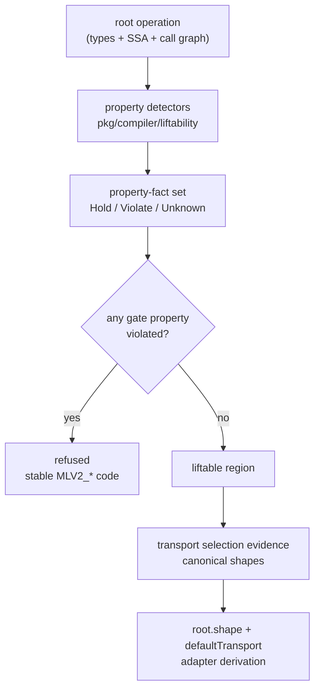

# Reasoning about liftability

## At a glance (for PLOS '25 readers)

In the paper, the thing being lifted was an **annotated interface** —
typically an HTTP handler: a function that took a request and wrote a
response. The working assumption was that a monolith's lift-worthy
surface would look like `net/http.Handler` (or something close to it),
and the compiler could pattern-match that single signature. That
assumption held for the prototype's demo but not for real Go codebases,
where web frameworks routinely wrap the standard handler with extra
arguments for middleware chaining, projects invent their own
request/response types over framework-specific context objects, and
domain-level handlers frequently carry no HTTP types at all.

v2 **revises** that assumption
([ADR-0017](https://github.com/tgoodwin/monolift/blob/main/docs/decisions/0017-classifier-reasons-about-liftability.md),
[ADR-0018](https://github.com/tgoodwin/monolift/blob/main/docs/decisions/0018-liftability-property-taxonomy.md),
under
[ADR-0009](https://github.com/tgoodwin/monolift/blob/main/docs/decisions/0009-plos-claims-preserve-revise-retire.md)'s
preserve / revise / retire discipline). The compiler no longer admits
a lift because its root function resembles a framework archetype. It
admits a lift when named **liftability properties** hold: boundary
properties such as `boundary.no-streaming-values`, effect properties
such as `effects.no-param-heap-mutation`, lifecycle properties such
as `lifecycle.execution-profile`, and contract properties such as
`contract.error-last`. Canonical shapes survive, but in the narrower
role ADR-0006 always needed downstream: they are named signature and
framework patterns used for transport selection and adapter derivation
after admission has already been decided.

This page covers **Layer 1** of the current architecture: the shared
property vocabulary and the admission gate. The next page builds on
this one by showing how state archetypes consume the same property
facts rather than inventing a second vocabulary.

## The design pressure, in one paragraph

Most of the Go monoliths in Monolift's pinned evaluation corpus - Caddy,
Gitea, Mattermost, Miniflux, Pocketbase, Listmonk - define custom
request dispatch, and that design shows up in signatures. Caddy's
middleware takes three arguments, not two. Gitea wraps
`*context.Context` instead of `*http.Request`. Miniflux's domain
handlers often carry no HTTP types at all. But the deeper problem is
not that there are too many handler shapes to list; it is that handler
shape was the wrong criterion for admission. A region is liftable because
its boundary can cross a network, its body does not mutate caller-owned
memory through aliases, its lifecycle can be hosted remotely, and its
contract has vocabulary for remote failure. Transport-specific facts
such as `transport.handler-boundary` still matter, but they are
selection evidence, not the admission rule.

## The layered classifier



ADR-0018 freezes three outcome classes. **Admission-gating** properties
can refuse the lift when violated: for example,
`boundary.no-streaming-values` maps to `MLV2_CHANNEL_BOUNDARY`, and
`effects.no-global-writes` maps to `MLV2_SHARED_MUTABLE_STATE`.
**Transport-biasing** properties help the selector choose a transport
after the region is admitted: for example, `transport.handler-boundary`
recognizes `net/http` and Caddy-style handler boundaries. **Advisory**
properties enrich reports without creating a new refusal path on their
own. ADR-0018 also contains heuristic evidence: evidence that is useful
but not strong enough to prove a property. The containment rule is that
sound detectors may gate; heuristic evidence defaults to `Unknown` or
advisory rather than creating false refusals.

The important shift is that canonical shapes no longer decide whether
the code is admissible. They are downstream vocabulary for transport
and adapter derivation, still organized by
[ADR-0006](https://github.com/tgoodwin/monolift/blob/main/docs/decisions/0006-canonical-shapes-transport.md)
and
[ADR-0007](https://github.com/tgoodwin/monolift/blob/main/docs/decisions/0007-shape-preserving-transport.md).

## Monolift's property gate, paired with a transport signal

The Monolift side is `evaluateOperation` and `decideAdmission`.
`evaluateOperation` runs the detector registry, sorts the emitted
property evidence, and hands the full property-fact set to the
admission decision. `decideAdmission` refuses only when a violated
property maps to an `MLV2_*` code. The Caddy side is deliberately the
old motivating example: the three-argument middleware signature still
matters, but now it contributes `transport.handler-boundary` for
selection rather than standing in for liftability itself.

<div class="code-pair" markdown="1">

<div markdown="1">
<div class="pair-caption">Monolift — <code>pkg/compiler/liftability/detector.go</code></div>

```go
--8<-- "docs/site/snippets/internal/liftability-property-evaluation.go.txt"
```

<div class="pair-caption">Monolift — <code>pkg/compiler/liftability/decision.go</code></div>

```go
--8<-- "docs/site/snippets/internal/liftability-refusal-map.go.txt"
```
</div>

<div markdown="1">
<div class="pair-caption">Caddy — <code>modules/caddyhttp/caddyhttp.go</code> and a concrete middleware</div>

```go
--8<-- "docs/site/snippets/external/caddy/middleware-handler-interface.go.txt"
```

```go
--8<-- "docs/site/snippets/external/caddy/tracing-middleware-impl.go.txt"
```
</div>

</div>

## Why we did this

Property-first admission keeps Monolift aimed at local code that can be
made remote, not only at code that already looks like a network
endpoint. It also gives the rest of the compiler one shared vocabulary:
the same facts that admit a region become the facts state archetypes
consume on the next page. That invariant is what makes ADR-0022's
candidate-set and subsumption rules precise — candidate archetypes are
comparable because their required invariants are subsets of the same
ADR-0018 property vocabulary.
