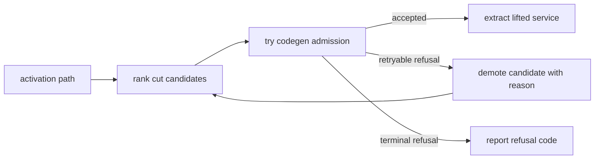

# Drawing the network boundary

## Research question and result

The workshop paper described calls becoming remote invocations, but it
left an important placement question under-specified: once the compiler
knows which region the developer wants to lift, where along the
activation path should the program actually split? The **lift target**
and the **cut point** are not always the same function.

Monolift treats every function on the activation path as a candidate cut
point and ranks those candidates by ordered tie-breakers: boundary data,
surface area, callbacks, receiver-state reconstruction, error semantics,
and alignment with existing component boundaries. On the pinned corpus,
the analyzer matches 71 of 72 reviewed cut recommendations; the same
enterprise-package build issue accounts for the remaining miss.

## Why the lift target is not always the cut point

A developer points Monolift at a region of code and says: run this
somewhere else. This is the **lift target**, the region the developer
wants extracted. But Monolift does not necessarily place the network
boundary at the lift target itself. It places the boundary at the **cut
point**, which may be at a point higher up the activation path.

The distinction matters because the cut point is where the program
splits in two. Everything above the cut stays in the monolith.
Everything below runs remotely. The cut-point function's parameters
become the network request; its return values become the response. If
those parameters include something that cannot cross a network — a
mutex, a file handle, a channel — then that cut does not work,
regardless of how cleanly the lift target itself could run remotely.

So the compiler's job is not just to find a path from `main()` to the
target (the [previous page](activation-paths.md) covered that). It is
to walk that path and decide: of all the functions along this chain,
which one is the best place to insert the network boundary?

## What makes a good cut

Every function on the activation path is a candidate. The compiler
evaluates each one along six dimensions, all derived from the
function's type signature and position on the activation path:

**Can the data cross a network?** The function's parameters and return
values will become a serialized request and response. Strings, integers,
and structs of exported fields are straightforward. A `*sql.DB` cannot
be serialized, but it can be *reconstructed* on the remote side from a
connection string — the compiler knows this and treats it differently.
A `func()` parameter or an `http.ResponseWriter` cannot be
reconstructed at all. Those make the candidate infeasible.

**Does the function call back into code above the cut?** If the
function takes a callback that invokes logic in the monolith, the
remote service would need to call back across the network on every
invocation. Zero callbacks is ideal. A few are manageable. Many make the
cut impractical.

**How much state needs to be rebuilt?** A stateless function (no
receiver) is easiest. A method on a struct that holds only configuration
is almost as easy. A method whose receiver contains a database pool or
HTTP client can be rebuilt from environment variables. A method whose
receiver holds a shared mutable cache or a mutex-protected map — that
state cannot be replicated remotely, and the cut is a poor choice.

**How much of the application moves?** A cut near `main()` extracts
nearly the entire program, which defeats the purpose. A cut near the
bottom of the path extracts a small, focused piece. The compiler
measures this as **surface area**: what fraction of the activation path
ends up on the remote side.

**Can errors be reported?** If the function returns an `error`, the
client stub can report remote failures naturally. If it has no failure
path at all, there is no clean way to surface a network error to the
caller.

**Does the edge align with a natural boundary?** A natural boundary is
a conceptual boundary between application components: the point where
one part of the program already hands control to another through a
contract. Some edges on the activation path already have that shape:
an interface dispatch, an HTTP handler registration, or a callback
handoff. Cutting at one of those edges is less disruptive because the
code was already written as if the callee were a replaceable component.
A direct function call within the same package is the opposite: cutting
there introduces a component boundary where none existed.

## The decision tree

The compiler does not collapse these six dimensions into a single
score. Instead, it compares candidates with ordered tie-breakers. It
starts with the highest-priority dimension; if two candidates are equal
there, it moves to the next dimension, and so on. The first dimension
that differs decides the winner. This makes the decision transparent
and auditable: the compiler can always say *which* dimension was
decisive and why.

The priority order is:

```
1. Hard gate                can the boundary data cross a network at all?
                            if not → Infeasible (rejected outright)

2. Surface area             how much of the application moves?
                            Minimal > Small > Medium > Large > VeryLarge

3. Callbacks                does the function call back above the cut?
                            Zero > Low > Moderate > Many

4. State reconstruction     how much receiver state must be rebuilt?
                            Stateless > ConfigOnly > Reconstructible > SharedState

5. Error semantics          can the function report failure?
                            ErrorOK > NeedsWrapper > ErrorInfeasible

6. Edge alignment           does the edge look like a natural boundary?
                            Strong > Weak > Anti

7. Final tiebreaker         deeper step wins; then function name for determinism
```

Surface area ranks first among the ranking dimensions because, without
it, shallow startup functions near `main()` win on every other metric. A
function at step 2 of a 13-step path might be stateless with zero
callbacks, but extracting it means extracting the entire application.
The corpus confirmed this: across the 72 reviewed traces, the mean
recommended cut depth was 0.92 (where 1.0 means the very last step). In
practice, the recommended cuts are usually close to the lift target.

## A concrete example

Consider two Miniflux functions from the evaluation corpus.

**`SanitizeHTML`** takes raw HTML and returns sanitized HTML. It is a
pure function: two string parameters, a small options struct, and a
string return value. No receiver, no state, no callbacks. The
activation path from `main()` is 6 steps long, and `SanitizeHTML` sits
at the bottom. The lift target and the cut point are the same function.

<div class="code-pair" markdown="1">

<div markdown="1">
<div class="pair-caption">Miniflux — <code>SanitizeHTML</code> (lift target = cut point)</div>

```go
--8<-- "docs/site/snippets/external/miniflux/sanitize-html-signature.go.txt"
```

All parameters are strings or a simple struct — **trivially
serializable**. The function is stateless, has no callbacks, returns a
string. Every dimension is ideal. The compiler places the cut here
without adding an intermediate boundary.
</div>

<div markdown="1">
<div class="pair-caption">Miniflux — <code>RefreshFeed</code> (lift target = cut point, but boundary data is more complex)</div>

```go
--8<-- "docs/site/snippets/external/miniflux/refresh-feed-signature.go.txt"
```

The `*storage.Storage` parameter wraps a `*sql.DB`. It cannot be
serialized, but the compiler classifies it as **reconstructible**: the
remote service can open its own database connection from an environment
variable at startup. The integers and boolean are trivial. The cut
still works — but the compiler notes the reconstruction cost.
</div>

</div>

In both cases the lift target and cut point happen to coincide. But
they do not have to. Many of the Gitea traces in the evaluation corpus
show a different pattern: the lift target is a domain function several
steps deep, but the recommended cut point is a `handler` closure one or
two steps above it — because the handler's signature is cleaner (better
boundary data), it sits at a natural dispatch boundary (strong edge
alignment), and the extra surface area is small.

## Where the cut point diverges from the lift target

In about a third of the 72 reviewed traces, the recommended cut point is
not the lift target itself but a function above it on the path. This
happens for predictable reasons:

- **The lift target's signature is harder to serialize.** A function
  deep in the call chain might take a framework context, a logger, and
  a database handle as separate parameters. The function one step above
  it might receive a single request struct that bundles the data more
  cleanly.

- **The lift target is a small helper.** Extracting a 10-line utility
  function is technically possible but creates a remote service that
  does almost nothing. Moving the cut one or two steps up captures a
  more meaningful unit of work.

- **The edge above the lift target is a stronger boundary.** If the
  lift target is reached by a direct call within the same package, but
  the function above it is dispatched through an interface or retrieved
  from a handler registry, the higher cut aligns with an existing
  component boundary.

The compiler evaluates all candidates and reports why it chose the one
it did. Every rejected candidate gets a reason: "ranked below
recommended step 10: surface Minimal beat Large" or "rejected by
boundary-data hard gate: function-value parameter."

## When a ranked cut cannot be extracted

The decision tree is a placement proposal, not the final proof that a
lift can be extracted. It ranks candidates using activation-path
evidence: the cut-point signature, receiver state, callbacks, surface
area, error shape, and edge alignment. After ranking, codegen
admission builds a concrete lift plan for the recommended cut and
checks whether the compiler can actually generate the remote boundary.

The two phases intentionally use different mental models. The ranker
asks: **would this be a good network boundary if the compiler knew how
to realize it?** That keeps placement focused on semantics: small
surface area, simple boundary data, low callback pressure,
reconstructible state, and natural component edges. Extraction asks a
narrower question: **can this specific compiler version produce
correct artifacts for that boundary?** It needs concrete serializers,
reconstructors, constructor arguments, call-site patches, imports,
shutdown hooks, and deployment environment.

That gap is useful. A candidate may be architecturally better than its
neighbors but still fail extraction because a reconstructor is
missing, the receiver is only known through an interface field, or a
type is serializable in principle but unsupported by the current codec
table. If the ranker tried to bake every extraction limitation into
its own model, cut placement would become a shadow code generator.
Instead, placement proposes the best semantic boundary; admission
tests whether the current extractor can make it real.

Admission asks questions that are deliberately more concrete than
placement:

- Are every parameter and return value supported by the wire format?
- If a receiver or parameter is not serializable, is there a registered
  reconstructor with enough metadata to rebuild it remotely?
- Can the generated server construct the receiver and call the selected
  method without hidden application state?
- Can the host call site be patched without changing the source-level
  API exposed to surrounding code?
- Does the plan preserve the local fallback and failure behavior the
  contract requires?

If the top-ranked candidate fails one of these checks for a reason that
a deeper cut might avoid, the compiler demotes that candidate and
reruns the same ranking over the remaining feasible candidates. This
turns admission from a terminal yes/no gate into feedback for placement:
the recommender still prefers small, deep, low-state cuts, but it also
learns when a theoretically good boundary cannot be generated.



This loop keeps the activation analyzer independent from codegen. The
activation package can rank candidates using general static evidence;
codegen owns the more implementation-specific question of whether a
candidate can be rendered into server, client, patch, and deployment
artifacts. The only information that flows back is structured: which
candidate failed, and why. That reason becomes part of the cut report
rather than a hidden special case.

## Monolift's comparator, paired with the data it classifies

The Monolift side is `betterCutCandidate` — the comparator that applies
the priority order above. Each candidate carries its classifications as
fields, not as a collapsed score, so the decisive dimension is always
recoverable.

<div class="code-pair" markdown="1">

<div markdown="1">
<div class="pair-caption">Monolift — <code>pkg/activation/cut.go</code></div>

```go
--8<-- "docs/site/snippets/internal/cut-decision-tree.go.txt"
```
</div>

<div markdown="1">
<div class="pair-caption">Monolift — <code>pkg/activation/cut.go</code></div>

```go
--8<-- "docs/site/snippets/internal/cut-candidate-type.go.txt"
```

Each field on `CutCandidate` is one of the six classification
dimensions. `Feasibility` is the non-negotiable gate: if `Infeasible`,
the candidate is rejected before ranking begins. The remaining five
fields are compared in the priority order shown in the comparator.
</div>

</div>

## The monolith stays as the gateway

One decision shapes everything else about cut placement: after a
function is lifted, **the monolith keeps running**. It continues to
serve its public API. Clients still hit the monolith. At the cut point,
the monolith makes an RPC to the lifted service instead of a local
function call. Only the cut-point function's parameters and return
values cross the network.

This is the model described in the original paper, but its consequences
for cut placement were not obvious until the corpus evaluation surfaced
them. Six traces initially diverged from the reference answers because
the analyzer preferred a shallow cut with an `http.ResponseWriter` in
its signature. But `http.ResponseWriter` is the monolith's HTTP lifecycle
handle — it should never reach the boundary. If it appears in a
candidate's parameters, the cut is too shallow. The fix is not to proxy
the writer across the network; it is to cut deeper, below the HTTP
layer.

This insight collapsed the original three-way feasibility classification
(Feasible / FeasibleWithProxy / Infeasible) into two. A cut either
works or it does not. Streaming types at the boundary are not a
"feasible with extra work" case — they are a signal that the compiler
should look further down the path.

## Evaluation

The cut-placement analyzer was validated against the same 72 reviewed
traces used for activation-path recovery. For each trace, three
independent agents had already identified the recommended cut by hand,
recording the function name, step index, boundary data class, state
class, and feasibility. The analyzer's output was compared against this
table.

| Project | Traces | Correct | |
|---|---:|---:|---|
| Caddy | 6 | 6 | |
| Gitea | 18 | 18 | |
| Listmonk | 10 | 10 | |
| Mattermost | 15 | 14 | 1 structural gap (enterprise build) |
| Miniflux | 12 | 12 | |
| PocketBase | 11 | 11 | |
| **Total** | **72** | **71** | **98.6%** |

## Design principles

**Ordered tie-breakers, not numeric weights.** The decision tree does
not assign weights to dimensions and add them up. It compares dimensions
in strict priority order: if two candidates tie on the first dimension,
the next dimension decides, and so on. This makes the decision auditable:
the compiler can always name the single dimension that was decisive,
rather than reporting an opaque composite score.

**Designed from data.** The six dimensions and their priority ordering
were not chosen from theory. They were synthesized from 72 hand-traced
cut recommendations across six real codebases. The ordering was chosen
to match the reviewed traces, not to satisfy an abstract principle.

**Refuse, don't approximate.** When a function's boundary data includes
something that cannot cross a network — a channel, a mutex, a function
value — the compiler rejects the candidate outright rather than
attempting a partial solution. Every rejection carries a reason that
points back to the specific parameter or type that caused it.

**Cut deeper, don't proxy.** When a streaming type appears at the
boundary, the answer is not to add a proxy layer. It is to move the
cut further down the path, past the streaming machinery, to where the
data is concrete and serializable. The monolith handles the HTTP
lifecycle; the lifted service handles the domain logic.
