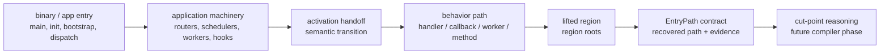
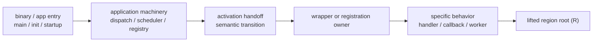
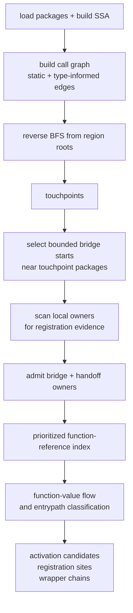

# Recovering activation paths

## At a glance

When Monolift lifts a region of code, it needs to understand how that
region is activated by the surrounding application. This page uses
**entry path** to mean the recovered static connection from code in or
near a lifted region outward toward the application's binary entrypoint
and bootstrap/dispatch machinery. Along that path, an **activation
handoff** is the point where broad application control becomes the
specific behavior chain that reaches the lifted region.

That handoff may be implemented by an HTTP route, gRPC service, queue
worker, cron job, CLI command, lifecycle hook, callback registry,
framework module, or a direct startup goroutine. Those are evidence
families, not the definition. The definition is about the role a point
plays on the path between application startup/dispatch and the lifted
region.

Recovering the entry path is a precursor to choosing the right
**distribution cut point** around the lifted region. The developer can
declare the code they would like to lift, but that declaration is not
automatically the right place to make the network incision. The compiler
still has to decide where control should cross from the monolith into an
extracted service. Sometimes that cut is obvious, such as the methods on
an object being extracted. In other cases the right cut sits higher up
or lower down along the activation path.

The direct call graph answers part of the question: it can show
functions that call, or are called by, the lifted region. The missing
piece is often the **activation handoff**: the static connection between
general application machinery and the unit of behavior that eventually
reaches the lifted code. Real Go services often express that handoff
outside the direct call path. A handler might be passed into a router,
wrapped by middleware, stored in a registry, attached to a service
object, scheduled as a cron callback, or launched as background work
before the lifted region ever runs.

The research question is:

> What is the smallest static graph whose edges are meaningful enough
> that a path from application roots to region roots corresponds to a
> real activation path?

The compiler's current strategy is a first approximation to that graph.
It uses a **bridge search** that combines two searches. First, it
uses the call graph in reverse, starting at the lifted region, to find
nearby code that already reaches that region. That is not enough by
itself because registration often moves callable values through
arguments, fields, tables, or wrappers rather than through a direct call
edge. So the bridge then switches to a bounded reference search, which
is similar to an IDE's "find all references" operation but with compiler
budgets and filters: it asks where selected functions, methods, and
function values are mentioned, without scanning every owner in the
program. The search is looking for concrete instances of registration
patterns the compiler can see in SSA: a handler passed to a router, a
method value stored in a table, a callback returned by a wrapper, or a
service implementation attached to a registry. It is more expansive than
a pure call-path search, but much smaller than scanning every function
in the program.

The exhaustive version of this idea is straightforward: index function
references across the whole program and let value-flow analysis find the
registration path wherever it lives. That gives a useful upper bound, and
it did recover the Mattermost diagnostic chain, but it scans far more
owners than the bridge needs. The bridge is the cheaper version of the
same basic recovery strategy: use the call graph to narrow the search
area, then spend the reference-indexing work only on the owners admitted
by the bridge.

That design choice keeps the analysis explainable and budgeted. The
current implementation mostly recognizes **statically visible
registration patterns**: handlers registered with routers, methods
attached to generated service registries, callback tables, worker
queues, command trees, and similar structures. That is an evidence
strategy, not the full abstraction. The broader target is to identify
handoff points on the path from application entry/bootstrap to the
lifted region. The current implementation has the strongest handoff
evidence for HTTP-like registrations, which is exactly why the next work
is about making the abstraction less mechanism-shaped.

## Where this is heading

The current EntryPath work is turning into a staged compiler pipeline:

The important separation is that EntryPath does not itself choose where
to distribute the program. It recovers the activation context around a
lifted region and exposes enough structured evidence for a later phase
to reason about activation handoffs and distribution cut points.

### EntryPath contract

**Status:** work in progress.

The next contract should be a normalized producer result, not the raw
diagnostic probe output. It should preserve durable facts such as region
roots, touchpoints, activation handoff candidates, graph edges, source
positions, and unsupported gaps. It should not expose probe-only details
such as oracle traces, bridge coverage, raw timing data, peak RSS, or
budget stops as the downstream compiler API.

TODO: replace this section with the concrete `pkg/compiler/entrypath`
type and conversion function once the current corpus validation sprint
lands.

### Activation Handoff Reasoning

**Status:** planned.

An activation handoff is the semantic transition on the path between
application entry/bootstrap and the lifted region. The shared question
is not "which framework mechanism is this?" but "where does broad
application control become the specific behavior chain that reaches this
region?"

Framework mechanisms still matter, but as evidence. A route
registration, cron callback, queue worker, lifecycle hook, command
function, direct goroutine launch, or service registry can all provide
evidence for such a handoff. The algorithm should reason about the role
of the handoff first, then attach protocol or framework-specific facts
as supporting evidence.

TODO: document the handoff-evidence vocabulary once the graph model is
clearer. The useful categories may be generic edge types rather than
framework families.

### Distribution cut point

**Status:** planned.

The distribution cut point is the later placement decision: given a
recovered entry path and activation handoff evidence, where should
Monolift introduce the generated remote boundary so the lifted region is
invoked correctly and with the least unnecessary application context?

TODO: document the cut-point selector once it exists. For now, the key
constraint is that EntryPath should retain the evidence a selector would
need, without making the selection itself.

## The Incision Problem

A lifted region has **region roots**: the functions the developer asked
Monolift to extract. But the region roots are not automatically the
right distribution cut point. They may sit deep inside a handler,
worker, callback, lifecycle routine, or object method. To decide where
the extracted service should receive control, the compiler needs to
understand how control reaches the region in the monolith.

That makes the problem a graph-search problem between two sides of the
program:

- **application roots**: `main`, `init`, server bootstrap, worker
  startup, lifecycle registration, or other code that establishes
  application execution machinery; and
- **region roots**: the developer-declared lifted code.

The output may not be one perfect path. Some regions have multiple
activation paths. Some paths contain dynamic dispatch or storage that
static analysis can only partially explain. The goal is to recover the
smallest useful activation graph, not to pretend every monolith has a
single clean endpoint-to-function chain.

Consider a common shape:

The call graph can often find `H -> R`. The harder question is how `H`
became reachable from application machinery. That connection might be a
function argument, a method value, a struct field, a table entry, a
wrapper closure, a goroutine launch, a callback registration, or a
dynamic invocation. EntryPath exists to recover enough of that graph to
support a later cut-point decision.

## Terminology

**SSA** is the compiler's inspection format. Go source is lowered into
typed instructions, so Monolift can reason about calls, stores, returns,
closures, method values, and interface values mechanically.

**Call graph** means the graph of possible calls between functions. It
includes direct static calls and type-informed edges from RTA/VTA-style
analysis, which helps when calls go through interfaces or function
values. In the current EntryPath implementation, Monolift builds this
graph with RTA first and uses VTA as a fallback when RTA appears to have
collapsed an indirect handler-shaped call. RTA/VTA help decide which
call edges may exist; they are not the same thing as the later reference
search for registration sites.

**Reverse BFS** is a backwards graph walk from the lifted region roots.
It finds functions that can already reach the region.

**Touchpoint** means a function found by reverse BFS. It is not
necessarily an activation handoff; it is a known point near the lifted
region.

**Activation graph** means the static graph Monolift is trying to
recover between application roots and region roots. Its edges must be
meaningful enough that paths through the graph correspond to real
activation behavior, not merely "these two functions appeared in the
same owner."

**Activation path** means one path through that graph explaining how
control reaches the lifted region.

**Activation handoff** means the semantic transition on an activation
path. Before the handoff, control is broad application machinery. After
the handoff, control is following the specific behavior chain that
reaches the region.

**Distribution cut point** means the later compiler decision about where
to insert the network transfer. It may coincide with an activation
handoff, but it is not the same concept.

**Owner** means the function whose SSA instructions contain the evidence
we care about. If a function stores a callback in a table, passes a
handler to a router, or returns a wrapper closure, that function is the
owner of that evidence.

**Handoff owner** means an owner with generic evidence that it is near
an activation handoff. Today that evidence is strongest for HTTP-like
registrations, such as `net/http` handler interfaces or
`ServeHTTP`-shaped values. The same role could be filled by
lifecycle-hook, scheduler, queue-handler, command-dispatch,
service-registration, or direct goroutine-launch evidence.

**Function-reference index** means a scoped "find references" pass for
functions. It records where function values are created, passed, stored,
returned, or used. Function values are not the whole algorithm; they are
one important evidence channel for registration-shaped Go code.

**Bridge owner** means an owner admitted into the bounded bridge search.
It may be admitted because it sits in a selected touchpoint package,
because it directly references a touchpoint, or because it carries
handoff evidence.

## Activation As Graph Search

The central research problem is defining the activation graph. A useful
graph probably needs more than ordinary call edges, but less than every
possible reference in the program.

Candidate edge families include:

- direct and type-informed call edges;
- function or method values passed as arguments;
- closures returned from factories;
- callable values stored in fields, globals, maps, slices, or tables;
- stored callable values loaded and invoked later;
- wrapper or adapter edges;
- goroutine launches;
- package `init`, `main`, and bootstrap calls; and
- explicit dynamic or unsupported gaps when the analysis can see a
  handoff but cannot prove the eventual invocation.

The hard part is precision. An edge should mean "this behavior can
activate that behavior", not just "these names appeared in the same
function." Without that discipline, a large router setup function can
connect a lifted region to unrelated handlers and produce noisy paths.

## Current Approximation: Bridge Search

The current implementation is a useful approximation to activation-graph
search. The phases are deliberately separated so their failure modes are
understandable.

1. **Load packages and build SSA.** This is the shared setup cost for
   static analysis. The bridge algorithm does not make this part cheap;
   it depends on it.

2. **Build the call graph.** The call graph gives the compiler a
   directional map between functions. It is enough to find code near the
   lifted region, but not enough to explain every registration edge.

3. **Run reverse BFS from the region roots.** This produces touchpoints:
   functions that already reach the lifted region.

4. **Select bridge starts.** The compiler chooses a bounded set of
   functions and packages near those touchpoints. This is the first place
   the algorithm chooses not to be exhaustive.

5. **Scan local owners.** Within the selected scope, the compiler scans
   SSA instructions for evidence that an owner moves executable behavior
   toward application machinery. That evidence can include function
   arguments, method values, stores, returns, closures, and
   handoff-shaped types.

6. **Admit bridge and handoff owners.** Owners with useful evidence
   become seeds for the next phase. Owners with handoff evidence get
   special priority because they are more likely to explain how broad
   application machinery reaches the lifted region.

7. **Build a prioritized function-reference index.** The index runs over
   admitted owners, not the entire program. Owners are ordered so handoff
   owners are scanned first, then owners with direct touchpoint
   references, then the rest of the selected-package owners.

8. **Classify EntryPath evidence.** The existing function-value flow
   uses the index to recover activation candidates, registration sites,
   and wrapper chains. In the current probe JSON, some of these
   activation candidates are still named `ExternalSurfaces`; the
   normalized contract is expected to use more general activation
   language.

## Why this is a bridge

The bridge connects two views of the program:

- the **call graph view**, which is good at finding code that reaches a
  lifted region; and
- the **reference/value-flow view**, which is good at explaining how a
  function, closure, or method value moves through application
  machinery.

Neither view is enough alone. A pure call path can stop too close to the
region and miss the registration site. A pure reference scan can recover
the path but may be too expensive on a large monolith. The bridge uses
the call graph to choose where to look, then uses reference evidence to
explain candidate activation paths.

## Open Research Questions

The current bridge suggests a direction, but the activation-graph model
is not settled. The open questions are:

1. **What are the graph nodes?** Functions are not always enough. A
   precise graph may need closures, method values, storage slots, fields,
   interface values, goroutine launches, and bootstrap sites.

2. **What are meaningful edges?** A direct call edge is meaningful, but
   activation often moves through values: function arguments, returns,
   stores, loads, wrapper closures, callback registries, interface
   dispatch, and goroutine launch.

3. **How do we avoid fake paths?** A graph edge that means "same owner
   mentions both functions" is too coarse. It can connect unrelated
   handlers in a large router setup function. Edges need enough SSA
   evidence to mean behavior transfer, not mere co-location.

4. **Do we produce one path or a small subgraph?** Some lifted regions
   are activated by multiple upstream paths, such as a request handler
   and a background worker that call the same domain function. The
   compiler may need to return multiple ranked activation paths, or a
   compact activation subgraph, rather than a single best path.

5. **How do we represent partial knowledge?** Static analysis may find a
   touchpoint but not the handoff, or find a handoff but not prove the
   later dynamic invocation. Those cases should be first-class evidence,
   not hidden as empty output.

6. **How does the cut-point selector consume this?** EntryPath should
   not choose the network incision itself. It should expose enough graph
   evidence for a later selector to evaluate possible cut points.

The approach may fail when:

- the activation path is created mostly through reflection or strings;
- generated code hides the useful registration evidence;
- dependency injection makes the static owner unclear;
- the graph edge is visible but currently unsupported; or
- the available static edge is too coarse to prove a real activation
  path.

## Cost Is A Later Concern

The current research question is not primarily budget tuning. Cost
matters for a production compiler, but optimizing the wrong graph would
only make the wrong answer faster. The next step is to find a graph
model whose paths correspond to real activation behavior across the
candidate applications. Once that model is credible, the compiler can
return to budgeting, pruning, and prioritization.

## Current status

On the Mattermost diagnostic chain, the consolidated bridge search
recovered the target path while indexing roughly 1.7k bridge owners
instead of doing the much larger exhaustive function-reference scan. The
result is promising enough to keep as the current EntryPath bridge
strategy, but it should not be treated as finished general activation
recovery.

The latest candidate pass showed the limit of the current abstraction:
Mattermost and Miniflux Fever are viable, but Miniflux refresh is noisy,
Gitea SSE is partial, and PocketBase autobackup misses the bootstrap and
scheduled-callback handoff. That does not mean EntryPath should become a
catalog of routers, queues, cron jobs, and lifecycle systems. It means
the underlying activation graph is not defined precisely enough yet.

The next useful validation step is to refine that graph model and test
whether root-linked callable-transfer edges can explain the candidate
set without relying on framework names or route strings. Only after that
should Monolift freeze a normalized EntryPath contract for downstream
cut-point selection.
