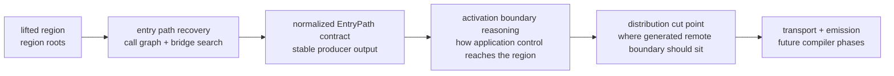
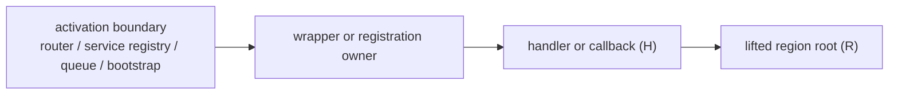

# Recovering activation paths

## At a glance

When Monolift lifts a region of code, it needs to understand how that
region is activated by the surrounding application. This page uses
**entry path** to mean the recovered static connection from code in or
near a lifted region outward toward the application's activation flow.
Along that path, an **activation boundary** is the place where the
application enters a registered or bootstrapped unit of behavior: an
HTTP route, gRPC service, queue worker, cron job, CLI command, lifecycle
hook, callback registry, framework module, or similar construct.

Recovering the entry path is a precursor to choosing the right
**distribution cut point** around the lifted region. Sometimes that cut
is obvious, such as the methods on an object being extracted. In other
cases the right cut sits higher up: a registered handler, callback,
queue consumer, or service method that already defines how the
application invokes the region.

The direct call graph answers part of the question: it can show
functions that call, or are called by, the lifted region. The missing
piece is often the **registration edge**: the static connection from an
activation boundary to the handler, callback, or method that eventually
reaches the lifted code. Real Go services often express that edge
outside the direct call path. A handler might be passed into a router,
wrapped by middleware, stored in a registry, or attached to a service
object before traffic ever reaches it.

The compiler's current strategy for this case is a
**boundary-registration bridge**. It combines two searches. First, it
uses the call graph in reverse, starting at the lifted region, to find
nearby code that already reaches that region. That is not enough by
itself because registration often moves callable values through
arguments, fields, tables, or wrappers rather than through a direct call
edge. So the bridge then switches to a bounded reference search, which
is similar to an IDE's "find all references" operation but with compiler
budgets and filters: it asks where selected functions, methods, and
function values are mentioned, without scanning every owner in the
program. The search is looking for concrete instances of registration
patterns the compiler can see in SSA: a handler passed to a router, a
method value stored in a table, a callback returned by a wrapper, or a
service implementation attached to a registry. It is more expansive than
a pure call-path search, but much smaller than scanning every function
in the program.

The exhaustive version of this idea is straightforward: index function
references across the whole program and let value-flow analysis find the
registration path wherever it lives. That gives a useful upper bound, and
it did recover the Mattermost diagnostic chain, but it scans far more
owners than the bridge needs. The bridge is the cheaper version of the
same basic recovery strategy: use the call graph to narrow the search
area, then spend the reference-indexing work only on the owners admitted
by the bridge.

That design choice keeps the analysis explainable and budgeted. Rather
than trying to solve every possible way a program could dispatch work at
runtime, the bridge focuses on **statically visible registration
patterns**: HTTP handlers registered with routers, methods attached to
generated service registries, callback tables, worker queues, command
trees, and similar structures. Those are the cases where the compiler
can point to a concrete registration site and say why it connects an
activation boundary to the lifted region. The current implementation has
the strongest boundary predicates for HTTP-shaped Go code, but the
algorithm itself is not tied to Mattermost or to any one router package.

## Where this is heading

The current EntryPath work is turning into a staged compiler pipeline:

The important separation is that EntryPath does not itself choose where
to distribute the program. It recovers the activation context around a
lifted region and exposes enough structured evidence for a later phase
to reason about the activation boundary and distribution cut point.

### EntryPath contract

**Status:** work in progress.

The next contract should be a normalized producer result, not the raw
diagnostic probe output. It should preserve durable facts such as region
roots, touchpoints, activation-boundary candidates,
registration/bootstrap sites, wrapper links, edge kinds, source
positions, and unsupported gaps. It should not expose probe-only details
such as oracle traces, bridge coverage, raw timing data, peak RSS, or
budget stops as the downstream compiler API.

TODO: replace this section with the concrete `pkg/compiler/entrypath`
type and conversion function once the current corpus validation sprint
lands.

### Activation boundary reasoning

**Status:** planned.

An activation boundary is not necessarily an API endpoint. It can be a
route registration, service registration, queue consumer, background
routine bootstrap, cron job, command hook, lifecycle callback, or custom
framework registry. The shared question is: where does application
control enter the unit of behavior that eventually reaches the lifted
region?

TODO: document the boundary-family vocabulary once the candidate corpus
pass shows which shapes EntryPath can recover reliably and which require
new predicates.

### Distribution cut point

**Status:** planned.

The distribution cut point is the later placement decision: given a
recovered entry path and activation boundary evidence, where should
Monolift introduce the generated remote boundary so the lifted region is
invoked correctly and with the least unnecessary application context?

TODO: document the cut-point selector once it exists. For now, the key
constraint is that EntryPath should retain the evidence a selector would
need, without making the selection itself.

## The problem: call paths miss registration paths

A lifted region has **region roots**: the functions the developer asked
Monolift to extract. From those roots, the compiler can walk backward
through the call graph to find functions that already reach the region.
Those functions are useful, so we call them **touchpoints**.

But a touchpoint is not always the activation boundary. Consider a common
shape:

The call graph can often find `H -> R`. The harder question is how `H`
became reachable from the boundary. That edge might be a function
argument, a method value, a struct field, a table entry, or a wrapper
closure. The boundary-registration bridge exists to recover that
registration path without falling back to an exhaustive whole-program
reference scan.

## Terminology

**SSA** is the compiler's inspection format. Go source is lowered into
typed instructions, so Monolift can reason about calls, stores, returns,
closures, method values, and interface values mechanically.

**Call graph** means the graph of possible calls between functions. It
includes direct static calls and type-informed edges from RTA/VTA-style
analysis, which helps when calls go through interfaces or function
values. In the current EntryPath implementation, Monolift builds this
graph with RTA first and uses VTA as a fallback when RTA appears to have
collapsed an indirect handler-shaped call. RTA/VTA help decide which
call edges may exist; they are not the same thing as the later reference
search for registration sites.

**Reverse BFS** is a backwards graph walk from the lifted region roots.
It finds functions that can already reach the region.

**Touchpoint** means a function found by reverse BFS. It is not
necessarily an activation boundary; it is a known point near the lifted
region.

**Activation boundary** means the point where the application enters a
registered or bootstrapped unit of behavior. API endpoints are one
activation-boundary family, but not the only one.

**Owner** means the function whose SSA instructions contain the evidence
we care about. If a function stores a callback in a table, passes a
handler to a router, or returns a wrapper closure, that function is the
owner of that evidence.

**Boundary owner** means an owner with generic evidence that it is near
an activation boundary. Today that evidence is strongest for HTTP-like
boundaries, such as `net/http` handler interfaces or `ServeHTTP`-shaped
values. The same role could be filled by gRPC service registration
evidence or queue-handler registration evidence.

**Function-reference index** means a scoped "find references" pass for
functions. It records where function values are created, passed, stored,
returned, or used. Function values are not the whole algorithm; they are
one important evidence channel for registration-shaped Go code.

**Bridge owner** means an owner admitted into the bounded bridge search.
It may be admitted because it sits in a selected touchpoint package,
because it directly references a touchpoint, or because it carries
boundary evidence.

## The algorithm

The phases are deliberately separated so their costs and failure modes
are understandable.

1. **Load packages and build SSA.** This is the shared setup cost for
   static analysis. The bridge algorithm does not make this part cheap;
   it depends on it.

2. **Build the call graph.** The call graph gives the compiler a
   directional map between functions. It is enough to find code near the
   lifted region, but not enough to explain every registration edge.

3. **Run reverse BFS from the region roots.** This produces touchpoints:
   functions that already reach the lifted region.

4. **Select bridge starts.** The compiler chooses a bounded set of
   functions and packages near those touchpoints. This is the first place
   the algorithm chooses not to be exhaustive.

5. **Scan local owners.** Within the selected budget, the compiler scans
   SSA instructions for evidence that an owner moves executable behavior
   toward a boundary. That evidence can include function arguments,
   method values, stores, returns, closures, and boundary-shaped types.

6. **Admit bridge and boundary owners.** Owners with useful evidence
   become seeds for the next phase. Owners with boundary evidence get
   special priority because they are more likely to explain how external
   traffic enters the lifted region.

7. **Build a prioritized function-reference index.** The index runs over
   admitted owners, not the entire program. Owners are ordered so boundary
   owners are scanned first, then owners with direct touchpoint
   references, then the rest of the selected-package owners.

8. **Classify entrypath evidence.** The existing function-value flow
   uses the index to recover activation candidates, registration sites,
   and wrapper chains. In the current probe JSON, some of these
   activation candidates are still named `ExternalSurfaces`; the
   normalized contract is expected to use more general activation
   language.

## Why this is a bridge

The bridge connects two views of the program:

- the **call graph view**, which is good at finding code that reaches a
  lifted region; and
- the **reference/registration view**, which is good at explaining how a
  function or method became attached to an activation boundary.

Neither view is enough alone. A pure call path can stop too close to the
region and miss the registration site. A pure reference scan can recover
the path but may be too expensive on a large monolith. The bridge uses
the call graph to choose where to look, then uses reference evidence to
explain the registration path.

## What makes it generalizable, and what does not

The general part is the shape of the search:

1. Start from region roots.
2. Find nearby touchpoints with the call graph.
3. Look for registration evidence near those touchpoints.
4. Prioritize owners that look like external boundaries.
5. Index only the admitted owners.

The current implementation's strongest evidence channel is
function-value movement because Go registrations often pass functions,
methods, or closures into framework code. That should not be read as
"this only works for one Mattermost function." It should be read as
"this works best when the entrypath is statically visible as executable
behavior being registered somewhere."

For a gRPC service, the boundary evidence might be generated
`RegisterXServer` calls, service descriptors, or interface
implementations. For a queue system, it might be handler registration in
a job table. For a CLI command tree, it might be command structs with
callable run hooks. Those would require more boundary predicates, but
the bridge pipeline would stay the same.

The approach may fail when:

- the activation path is created mostly through reflection or strings;
- generated code hides the useful registration evidence;
- dependency injection makes the static owner unclear;
- the relevant owner is outside the bridge budgets; or
- the boundary family has no predicate yet.

## Budget model

Sprint 32 clarified the cost envelope. Bridge discovery and bridge
indexing now have separate budgets:

- bridge discovery is bounded by package, owner, instruction, start, and
  duration limits; and
- function-reference indexing has its own phase-local budget over the
  admitted bridge owners.

That split matters. Before the cleanup, bridge discovery could consume
the function-index budget before indexing began. The compiler could find
the right owners, then skip all of them at the indexing phase. With
phase-local indexing, the budget now describes what it says: time spent
indexing admitted bridge owners.

## Current status

On the Mattermost diagnostic chain, the consolidated bridge search
recovered the target path while indexing roughly 1.7k bridge owners
instead of doing the much larger exhaustive function-reference scan. The
result is promising enough to keep as the current EntryPath bridge
strategy, but it should not be treated as finished general activation
recovery.

The next useful validation step is not to make the Mattermost case more
clever. It is to test the same pipeline on a non-Mattermost registration
shape, such as a gRPC-style service registration or a typed job-handler
registry, and add only the boundary predicates needed for that family.
