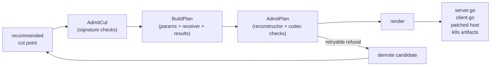

# Code extraction

## Research question and result

A cut point names where the program should split. It does not, on its
own, produce code that can run as a *lift*. The compiler still has to
extract the code below the cut: pull the function body out of the
monolith without rewriting it, generate the boundary scaffolding that
lets it run on the far side of a network call, and patch the host so
the original call site keeps its source-level API. The workshop paper
sketched a renderer for one fixed shape. The reboot turned that
sketch into a contract that real Go monoliths can satisfy.

Extraction handles three concerns: what travels on the wire, what is
rebuilt on the far side, and what the host call site looks like after
the patch. (Values that cannot cross a network — a database handle, a
logger — are rebuilt on the far side by generated code called a
*reconstructor*.) New capabilities are added by registering them. A new
reconstructor for a value type, a new receiver policy, or a new wire
codec is a small entry in a lookup table. The renderer reads those
entries and emits Go code from them. It does not contain a separate
code path for each family.

## What a lift is, and is not

The extraction phase produces a lift: a self-contained bundle of code
and metadata that can run remotely. The bundle does not name a
particular runtime shape. The current backend targets a long-running
Kubernetes Deployment (host pod plus a far-side pod, both in the same
namespace), and most of this page describes that backend concretely
because it is the only one in tree today. The extraction phase itself
is runtime-agnostic. A future backend that deploys each call as a
one-off serverless function invocation can reuse the same plan, the
same reconstructors, and the same patched host. Only the deployment
artifacts and the lifecycle of the far-side process change.

## Why this needs to be a separate phase

Cut placement
([drawing the network boundary](cut-placement.md)) asks whether a
function should be the network boundary. Extraction asks whether the
compiler can make it
one with the materials at hand: a wire format, a reconstructor for
each non-serializable input, a way to construct the receiver, a
deployment shape that carries the right environment, and a patched
call site that preserves the source-level API of the host.

These are deliberately different questions. The ranker can compare
two candidates without knowing whether a particular reconstructor
exists. Extraction cannot. Keeping the phases separate is what lets
admission act as feedback to placement instead of a hidden tax on it.

The function body on the far side of the boundary is the same Go
code that lived in the monolith: same package, same imports, same
logic. Extraction does not synthesize new business logic. What it
generates is the boundary. A handler that decodes a request and
calls the original function. A client stub the host calls instead
of the local symbol. Reconstructors that rebuild the function's
non-serializable dependencies. Deployment metadata that wires the
whole thing together.

## How extraction proceeds



`AdmitCut` is the cheap pass. It inspects the cut point's signature
against gates that do not depend on reconstructor availability.
`BuildPlan` then materializes the per-parameter classification:
boundary value, reconstructed value, or receiver. `AdmitPlan` checks
that every reconstructed parameter has a registered reconstructor
with the metadata needed to render its init code, and that the result
shape fits the transport. Today that means `(T)`, `(T, error)`, or
`error`.

If admission refuses with a code in the *retryable* set, codegen
demotes the candidate and reruns ranking against the remaining
feasible candidates. That loop is described on
[the cut-placement page](cut-placement.md).

The retryable refusals are intentionally small:

| Code | Meaning |
|---|---|
| `receiver_requires_reconstruction` | The receiver type cannot serialize and has no factory. A deeper cut may avoid the receiver. |
| `non_serializable_receiver` | The receiver embeds a non-serializable field, such as an interface or a channel. |
| `missing_reconstructor` | A parameter is reconstructible in principle, but no registered reconstructor matches its type. |
| `unsupported_result_shape` | The function returns more than two values, or its second result is not `error`. |

Every other refusal is terminal. A function-value parameter, a
streaming type the codec cannot lower, a verdict-level conflict from
the diagnostics pipeline: the compiler reports the named code and
stops.

## What travels on the wire

Each parameter is classified once, by type.

- **Boundary value.** Serialized through the wire codec and reproduced
  byte-identically on the far side. Strings, numbers, structs of
  exported fields, byte slices, and the small `(T, error)` result
  shape live here.
- **Reconstructed value.** Skipped on the wire entirely. The far side
  rebuilds an equivalent value from environment variables, a known
  factory, or a literal expression. A `*sql.DB`, a `context.Context`,
  and a logger interface are reconstructed. A string is not.
- **Receiver.** A method's receiver follows its own policy (next
  section). The receiver is not a normal parameter. Its policy
  decides whether it crosses the boundary, is built fresh, or is
  rebuilt via a registered factory.

Codecs are a finite set: `primitive`, `json`, `error`,
`localized_error_wrapper`, `streaming_bytes`. Adding a new wire shape
means adding an entry plus the encode/decode pair, not editing the
renderer.

## Reconstructors

A reconstructor knows how to rebuild one value type on the far side
of the boundary. Each one carries the imports it needs, the init
lines it emits, and optionally a shutdown line.

| Family | Trigger | What gets emitted |
|---|---|---|
| `context_background` | `context.Context` parameter | `state.X = context.Background()` |
| `discard_logger` | interface parameter whose name ends in `Logger` | `state.X = nil` |
| `sql_db` | `*sql.DB` parameter | `sql.Open(...)` + `PingContext` + `defer db.Close()` |
| `sql_db_wrapper` | struct that wraps `*sql.DB` (e.g. Miniflux's `*storage.Storage`) | `sql.Open` + `PingContext` + `pkg.New<Type>(db)` + `defer db.Close()` |
| `http_client` | `*http.Client` parameter | `&http.Client{Timeout: 30 * time.Second}` |
| `logger` | `*log.Logger` parameter | `log.New(os.Stderr, "", log.LstdFlags)` |

The set is deliberately conservative. Each reconstructor either
rebuilds a connection from an environment variable that the host
already exports, or constructs a value with no shared state. Two
properties hold across the family.

**Reconstruction is observable.** SQL reconstructors call
`PingContext` at startup, so a far-side process that cannot reach its
database fails fast with a named error instead of silently accepting
the first request and crashing under load.

**Reconstruction is reversible.** Every reconstructor that opens a
resource also emits a `defer` close on shutdown. The metadata exists
on the registry entry. The renderer does not special-case it. (For
a serverless backend where the process exits after each invocation,
the same close lines run on every invocation. The contract is written
against process lifetime, not request lifetime, and either shape
obeys it.)

For SQL reconstructors specifically, the planner also propagates the
single environment variable the resource needs (`DATABASE_URL`) into
the lift's deployment artifacts. The propagation is gated on the
reconstructor. Host environment variables do not leak into the lift
unless the plan explicitly asks for them. Project keys
(`GITEA__security__PASSWORD_HASH_ALGO`, etc.) stay in per-target
metadata, never in the global host environment.

## Receiver policies

Methods are the common case in real Go monoliths, so receivers need
their own taxonomy. The planner chooses one of three policies based
on the receiver type's state class and what is registered for it.

| Policy | When | What the far side does |
|---|---|---|
| `receiver_boundary` | Stateless receiver whose fields are all JSON-serializable | Decodes the receiver from the request body alongside the parameters. |
| `receiver_zero` | Stateless receiver whose fields are zero-safe and unread inside the method | Constructs a zero-value receiver and calls the method on it. |
| `receiver_factory` | Receiver type has a registered factory function (e.g. `NewArgon2Hasher(config string)`) | Calls the factory with the recorded constant arguments and uses the result. |

When none of the three apply, the planner refuses with
`receiver_requires_reconstruction`. That is the retryable refusal
that lets the ranker demote the parent cut and look for a deeper
admissible candidate. The Argon2 case is canonical. A
`(*PasswordHashAlgorithm)` parent refuses because it embeds an
interface, but its leaf `(*Argon2Hasher).HashWithSaltBytes` is in the
factory registry and admits cleanly after demotion.

## A concrete example

Miniflux's `RefreshFeed` is the smallest example that exercises every
moving piece: a method with a reconstructible wrapper-receiver, an
SQL-bearing dependency, and a `(T, error)` result. The cut point and
lift target coincide, so the entire plan exists in the extraction
phase.

<div class="code-pair" markdown="1">

<div markdown="1">
<div class="pair-caption">Miniflux: <code>RefreshFeed</code> signature</div>

```go
func RefreshFeed(
    store *storage.Storage,    // sql_db_wrapper reconstructor
    userID int64,              // boundary value
    feedID int64,              // boundary value
    forceRefresh bool,         // boundary value
) *locale.LocalizedErrorWrapper { ... }
```

`*storage.Storage` is a struct wrapping `*sql.DB`, so it matches
`sqlWrapperReconstructor` (`pkg/codegen/recon.go`). The remaining
parameters are primitives.
</div>

<div markdown="1">
<div class="pair-caption">Monolift: reconstructor init for <code>*storage.Storage</code></div>

```go
storeDB, err := sql.Open("postgres", os.Getenv("DATABASE_URL"))
if err != nil { return nil, err }
if err := storeDB.PingContext(context.Background()); err != nil {
    _ = storeDB.Close()
    return nil, err
}
state.Store = storage.NewStorage(storeDB)
```

The four lines are produced from one registry entry. Imports, the
constructor package, the constructor function, the argument order,
and the close line are fields on the `Reconstructor` struct, not
branches in the renderer.
</div>

</div>

The patched host call site keeps the source-level API of
`RefreshFeed`. Inside, the call now invokes a generated client stub
that posts a JSON request to the lift's address. The original
function is preserved under a renamed symbol so the host can fall
back to local execution when the lift is disabled.

## Design principles

**Registry entries, not branches.** Reconstructors, codecs, receiver
policies, and refusal codes are entries in small lookup tables. The
renderer walks entries. It does not contain a separate code path for
each family. Adding the SQL-wrapper family, the streaming-bytes
codec, and the receiver factory family followed the same shape each
time: one entry, plus the metadata it needed.

**Reconstruction is part of the contract, not a runtime hope.** A
reconstructor's metadata declares its imports, init code, close code,
and the environment variables it requires the deployment to carry.
Anything that depends on the resource also depends on the
reconstructor. That includes the env block on the lift's deployment
artifacts, which is computed from the plan rather than from a default
that propagates the host's environment.

**Admission is feedback, not a wall.** When a top-ranked cut fails
for a reason a deeper cut might avoid, extraction demotes the
candidate with a reason and reruns ranking. The retry set is
intentionally small. Non-retryable refusals are terminal and named.

**Fail fast at boundaries the compiler controls.** SQL reconstructors
call `PingContext` at startup. Generated `main` functions defer the
close lines the reconstructor declared. The lift either comes up with
a working dependency or fails with a named error. It does not
silently degrade. This holds whether the far side is a long-running
pod or a per-invocation function process.
