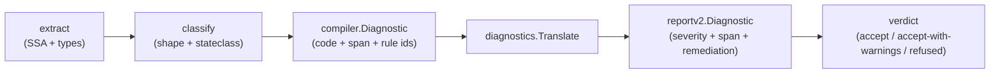

# Making the compiler opinionated

## At a glance (for PLOS '25 readers)

The paper committed early to a principle the prototype took seriously:
the compiler should refuse a lift it cannot distribute reliably, rather
than attempt it and hope. Refusal was the right default, but the
prototype articulated it mostly as a general stance — individual
refusals were implicit, hand-coded, or rolled into error messages that
did not always tell the developer *why* a given function was out of
scope, or what to do about it.

v2 **preserves** that principle and makes each refusal concrete
([ADR-0012](https://github.com/tgoodwin/monolift/blob/main/docs/decisions/0012-pragma-parser-diagnostics.md),
[ADR-0014](https://github.com/tgoodwin/monolift/blob/main/docs/decisions/0014-unbounded-edge-refusal-code.md),
under
[ADR-0009](https://github.com/tgoodwin/monolift/blob/main/docs/decisions/0009-plos-claims-preserve-revise-retire.md)'s
preserve / revise / retire discipline). Every refusal is now a named
code (`MLV2_*`), each code is bound to one or more rule IDs from the
v2 contract, and each diagnostic carries a source location and a
remediation hint that explains the expected code change. A single
translation step lowers internal compiler diagnostics to a stable
external report, so new refusal reasons land as table entries rather
than as switch statements scattered across the compiler. The stance
the paper took — refuse what you cannot distribute reliably — is
kept; what is added is the discipline of naming each refusal and
pointing at a fix.

## The design pressure, in one paragraph

Monolift refuses more than it lifts, and refusals are the contract with
the developer: every refusal is a named code (`MLV2_*`), every code maps
to a rule ID, and every diagnostic carries a span and an actionable
remediation hint. The design pressure is that real-world handlers do not
fit a single template — some are bound to stateful receivers, some
mutate embedded database-client fields during startup, some take
framework-specific argument shapes — so the diagnostic pipeline needs
to translate many kinds of compiler-internal refusals into one stable
reportv2 record without leaking internal structure.

## Extract → classify → translate → verdict



`Translate` is the single conversion point between compiler-internal
diagnostics and the public report schema. Every `MLV2_*` code has a
`codeSpecs` entry naming its default rule IDs and a remediation builder;
a diagnostic without a matching spec raises `UnknownCodeError` rather
than silently passing through. Spans are re-resolved against `ModuleRoot`
so reportv2 paths are portable across machines.

## Monolift's translator, paired with a handler that exercises it

The Monolift side is `diagnostics.Translate`: the per-diagnostic lookup
and conversion to reportv2. The Miniflux side is `currentUserHandler`, a
method handler that pulls the user ID from the request context, calls into
`*storage.Storage`, and writes a JSON response. Under the v2 classifier
this is `ctx-request-response` shape with `external` state via `h.store`;
the diagnostics pipeline is what surfaces any policy or state conflicts
(for example, `MLV2_STATE_DECL_CONFLICT` if a developer declared
`state=stateless` despite the storage mutation witnesses).

<div class="code-pair" markdown="1">

<div markdown="1">
<div class="pair-caption">Monolift — <code>pkg/compiler/diagnostics/translate.go</code></div>

<!-- site-anchor: refusal-translate -->
```go
--8<-- "pkg/compiler/diagnostics/translate.go:181:204"
```
</div>

<div markdown="1">
<div class="pair-caption">Miniflux — <code>internal/api/user_handlers.go</code></div>

```go
--8<-- "docs/site/snippets/external/miniflux/current-user-handler.go.txt"
```
</div>

</div>

## Why we did this

Centralizing translation in one function means new `MLV2_*` codes land as
table entries, not as scattered switch statements across the extractor.
See
[ADR-0012](https://github.com/tgoodwin/monolift/blob/main/docs/decisions/0012-pragma-parser-diagnostics.md)
for the pragma-parser diagnostic discipline,
[ADR-0014](https://github.com/tgoodwin/monolift/blob/main/docs/decisions/0014-unbounded-edge-refusal-code.md)
for the unbounded-edge refusal taxonomy, and
[ADR-0008](https://github.com/tgoodwin/monolift/blob/main/docs/decisions/0008-pocketbase-negative-case.md)
for Pocketbase as the motivating refusal anchor.
