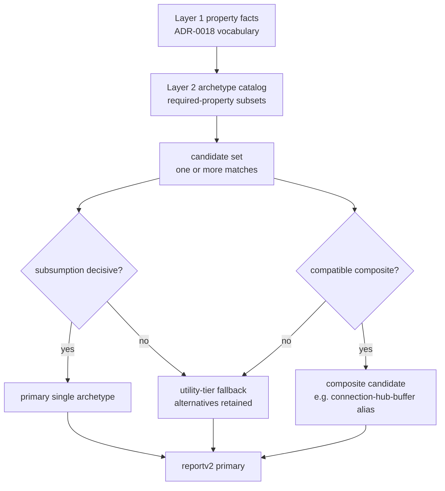

# Pattern matching on stateful code

## At a glance (for PLOS '25 readers)

In the paper, every lift was assumed to be **stateless**. A lifted
function was expected to read no captured variables, mutate no shared
memory, and hold no references to long-lived resources; anything
stateful was simply out of scope. That assumption kept the prototype's
semantics clean but ruled out most real production Go, where functions
routinely close over configuration, protect shared caches with locks or
atomics, talk to durable clients such as databases and message queues,
or read from channels inside long-running loops.

v2 **revises** the stateless rule
([ADR-0005](https://github.com/tgoodwin/monolift/blob/main/docs/decisions/0005-state-semantics-bounded-taxonomy.md),
[ADR-0016](https://github.com/tgoodwin/monolift/blob/main/docs/decisions/0016-state-class-inference.md),
[ADR-0022](https://github.com/tgoodwin/monolift/blob/main/docs/decisions/0022-composite-archetype-regions.md),
under
[ADR-0009](https://github.com/tgoodwin/monolift/blob/main/docs/decisions/0009-plos-claims-preserve-revise-retire.md)'s
preserve / revise / retire discipline). The compiler now treats
stateful regions as archetype candidates defined over the liftability
properties from the previous page. An archetype matches when its
required property subset is satisfied by the region's property-fact
set; when several archetypes match, ADR-0022 requires the compiler to
preserve the full candidate set, choose a primary by region-relative
subsumption or utility-tier fallback, emit composites only when the
component transforms are compatible, and report the alternatives.

This page covers **Layers 2 and 3** of the current architecture. Layer
2 is archetype matching: `serialized-actor`, `keyed-partitioned-state`,
and the rest of the catalog are defined as subsets of ADR-0018
properties. Layer 3 is candidate-set navigation: subsumption,
compatible composite emission, and report exposure. Transport selection
remains downstream.

## The design pressure, in one paragraph

A lifted function's captured state decides whether calling it remotely
is sound. The corpus offers a menu: Caddy's reverse-proxy handler owns
a mutex-protected `connections` map keyed by connection object;
Pocketbase's `BaseApp` reaches multiple embedded database clients;
Mattermost's websocket hub combines per-user connection indexing,
broadcast fanout, and per-connection send queues. No single scalar
"stateful" verdict classifies all of these. Monolift's answer is now
layered: first, the liftability pass produces facts such as
`effects.no-global-writes`, `effects.no-param-escape`,
`state.mutex-encloses-store-invariant`, and
`state.keyed-access-invariant`; then the archetype catalog matches
required subsets of those facts; then ADR-0022 decides what to do when
more than one viable transform is present.

## Archetypes consume the property vocabulary



The connective tissue is concrete in code. A `serialized-actor`
candidate is not a free-form label; its required set includes
`effects.no-param-heap-mutation`, `effects.no-param-escape`,
`effects.no-global-writes`, `state.mutex-encloses-store-invariant`, and
`state.receiver-owned-state`. A `keyed-partitioned-state` candidate
requires `effects.no-global-writes`, `state.receiver-owned-state`, and
`state.keyed-access-invariant`. Those names are the same `PropertyID`
constants the liftability page introduced. The archetype layer adds a
transform interpretation over the property set; it does not add a
separate fact language.

## Candidate sets, subsumption, and composites

ADR-0022 changes the old "one shape per region" mental model. The
classifier constructs every satisfied candidate before selecting a
primary. If candidate A's required invariants are a strict superset of
candidate B's on the same region, A **subsumes** B and becomes the
primary. If neither set contains the other, the candidates are
incomparable; the compiler uses ADR-0022's fallback tiers to choose a
deterministic primary and records the other candidates as alternatives.

Caddy C5 is the incomparability example. `Handler.connections` satisfies
the mutex/receiver/no-escape invariants for `serialized-actor` and the
keyed-access/receiver invariants for `keyed-partitioned-state`. Neither
required set is a strict superset of the other. ADR-0022 therefore does
not invent a semantic winner: it falls through to the utility tiers,
chooses `serialized-actor` because it preserves the native single-owner
topology of the connections struct, and reports
`keyed-partitioned-state` as an alternative. The two transforms are not
a compatible composite because sharding the map would contradict the
single-owner serialization transform.

Mattermost's Hub / WebConn region is the composite example. The
candidate set contains `keyed-partitioned-state`,
`fanout-publisher`, and `session-affinity-state`: ownership is keyed by
user or connection, delivery fans out through the hub, and WebConn state
is tied to a connection lifetime. Those refinements are **compatible**
because each narrows a different axis — ownership, routing, delivery —
without contradicting the others. ADR-0022 permits the report to expose
that composite under the informal alias `connection-hub-buffer`, while
keeping the normative identity compositional: contributing archetypes
plus region.

## Monolift's candidate machinery, paired with the examples

The Monolift side is the ADR-0022 vertical slice now present in
`pkg/compiler/stateclass/`: construct candidates from satisfied
property subsets, reduce them by subsumption, select a primary, and
convert the result into report fields that distinguish candidate
existence, static emittability, and runtime selection eligibility. The
Caddy side is the mutex-protected `connections` map that produces an
`alternative_set` today. The Mattermost side is intentionally described
in prose here because ADR-0022 has accepted the composite contract, but
the current implementation slice has not yet migrated all three
Mattermost component archetypes into first-class required-property sets.

<div class="code-pair" markdown="1">

<div markdown="1">
<div class="pair-caption">Monolift — <code>pkg/compiler/stateclass/archetype.go</code></div>

```go
--8<-- "docs/site/snippets/internal/archetype-required-properties.go.txt"
```

<div class="pair-caption">Monolift — <code>pkg/compiler/stateclass/selection.go</code></div>

```go
--8<-- "docs/site/snippets/internal/archetype-candidate-selection.go.txt"
```

<div class="pair-caption">Monolift — <code>pkg/compiler/stateclass/subsumption.go</code></div>

```go
--8<-- "docs/site/snippets/internal/archetype-subsumption.go.txt"
```
</div>

<div markdown="1">
<div class="pair-caption">Caddy C5 — <code>modules/caddyhttp/reverseproxy/streaming.go</code></div>

```go
--8<-- "docs/site/snippets/external/caddy/reverseproxy-connections-register.go.txt"
```

<div class="pair-caption">Mattermost MM1 + MM2 — <code>web_hub.go</code> / <code>web_conn.go</code></div>

```go
--8<-- "docs/site/snippets/external/mattermost/web-hub-fields.go.txt"
```

```go
--8<-- "docs/site/snippets/external/mattermost/web-conn-fields.go.txt"
```
</div>

</div>

## Why we did this

The bounded state taxonomy from ADR-0016 is still the starting point,
but ADR-0022 prevents the taxonomy from pretending the region space is
a partition. Real regions can satisfy more than one transform lens at
the same time. Candidate-set classification preserves that fact for
reports and future runtime selection, while subsumption keeps primary
selection auditable instead of encoding a global archetype ladder. See
[ADR-0017](https://github.com/tgoodwin/monolift/blob/main/docs/decisions/0017-classifier-reasons-about-liftability.md)
for the layered architecture note,
[ADR-0018](https://github.com/tgoodwin/monolift/blob/main/docs/decisions/0018-liftability-property-taxonomy.md)
for the shared property vocabulary, and
[ADR-0022](https://github.com/tgoodwin/monolift/blob/main/docs/decisions/0022-composite-archetype-regions.md)
for the candidate-set, subsumption, compatible-composite, and report
schema rules.
