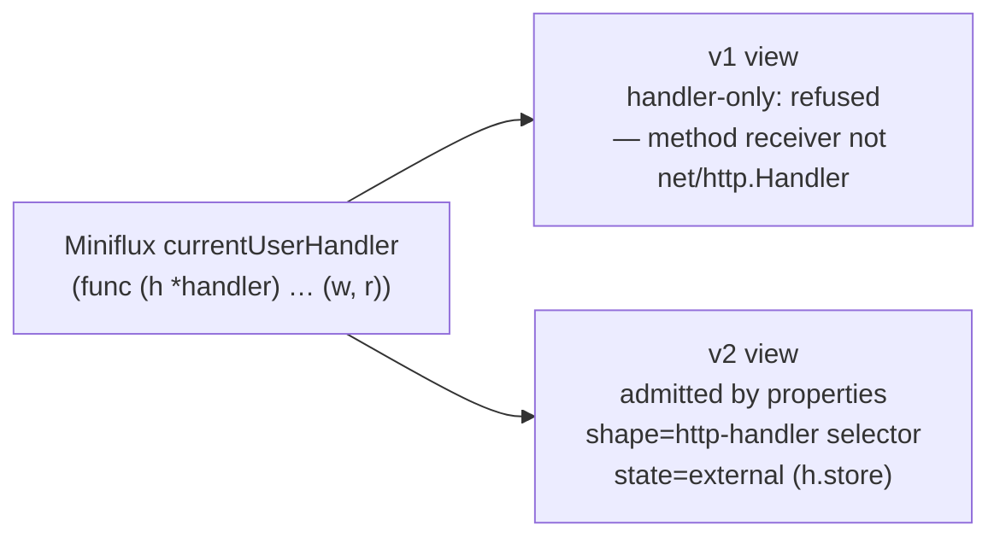

# What's changing after the initial workshop paper

## At a glance (for PLOS '25 readers)

The paper's working model was concrete and deliberately simple:
annotate an interface, wire the lift together in `main`, assume the
lifted function is stateless, and assume it looks like an HTTP handler.
Each of those commitments was useful for the demo application, but each
failed at least partially when the design met real production codebases.
The annotation surface was too narrow; wiring the lift in `main` missed
the places where the function was actually dispatched from; most
interesting functions held state the model could not
classify.

v2 is a principled revision of that model, not a replacement architecture.
Each paper commitment was audited and tagged as **preserve**,
**revise**, or **retire** under
[ADR-0009](https://github.com/tgoodwin/monolift/blob/main/docs/decisions/0009-plos-claims-preserve-revise-retire.md):
the commitment to refuse unsafe lifts and the pay-as-you-go promise
(that the monolith still runs uncompiled) are preserved; the
assumptions about the annotation surface and about statelessness are
revised
([ADR-0004](https://github.com/tgoodwin/monolift/blob/main/docs/decisions/0004-annotation-surface-generalized.md),
[ADR-0005](https://github.com/tgoodwin/monolift/blob/main/docs/decisions/0005-state-semantics-bounded-taxonomy.md));
the idea that the wiring lives in `main` is retired in favor of
extraction driven by the call graph
([ADR-0003](https://github.com/tgoodwin/monolift/blob/main/docs/decisions/0003-extraction-root-call-graph.md)).
This page traces one function that was refused under v1's contract and
is admitted under v2's, as a concrete illustration of the arc.

## The design pressure, in one paragraph

Monolift v1 was a handler-only lift tool: the pragma surface was narrow,
the only supported transport was `net/http.Handler`, and anything that
did not present a `func(http.ResponseWriter, *http.Request)` signature
was out of scope. The evaluation corpus made the limits obvious — most
real handlers are either framework-specific (three-argument middleware),
method-bound on stateful receivers, or domain-shaped with no HTTP types
at all. **v2** renegotiates the contract: a per-surface key schema with
validated value enums, liftability-property admission instead of
signature admission, bounded state semantics, and refusal codes with
remediation hints. Canonical shapes remain visible in reports, but as
transport-selection output after the property gate has admitted the
region.

## The contrast, on one handler



Under v1, the `*handler` receiver alone disqualifies the method: there
is no handler-only path from `(w, r)` to a bindable `http.Handler` without
also lifting the receiver, and v1 had no vocabulary for "receiver state."
Under v2, the same function is admitted because its boundary and body
properties pass the liftability gate. The method-bound handler signature
then biases transport selection toward `http-handler`, and the
`*storage.Storage` field types to an external-client state class that the
pragma can declare with `state=external`.

## The v2 validator, paired with the handler it now admits

The Monolift side is `validatePragma` — the per-surface key schema that
is the v2 contract's enforcement point. It is how `state`, `transport`,
`mode`, and `dispatch` stop being free-text fields and start being
validated enums. The Miniflux side is the same `currentUserHandler`
refused under v1 and admitted under v2: the handler did not change; the
compiler contract did.

<div class="code-pair" markdown="1">

<div markdown="1">
<div class="pair-caption">Monolift — <code>pkg/compiler/pragma_keys.go</code></div>

<!-- site-anchor: pragma-v2-validator -->
```go
--8<-- "pkg/compiler/pragma_keys.go:53:99"
```
</div>

<div markdown="1">
<div class="pair-caption">Miniflux — <code>internal/api/user_handlers.go</code></div>

```go
--8<-- "docs/site/snippets/external/miniflux/current-user-handler.go.txt"
```
</div>

</div>

## Why we did this

v1's handler-only contract could not express most of the corpus without
per-target special-casing. v2 uses a more precise lexicon of pragma keys,
a property-driven admission contract, and a wider set of downstream
transport choices. See
[ADR-0002](https://github.com/tgoodwin/monolift/blob/main/docs/decisions/0002-renegotiate-contract-v2.md)
for the v1 → v2 renegotiation,
[ADR-0003](https://github.com/tgoodwin/monolift/blob/main/docs/decisions/0003-extraction-root-call-graph.md)
for the call-graph root choice,
[ADR-0004](https://github.com/tgoodwin/monolift/blob/main/docs/decisions/0004-annotation-surface-generalized.md)
for the generalized annotation surface,
[ADR-0011](https://github.com/tgoodwin/monolift/blob/main/docs/decisions/0011-harness-before-compiler.md)
for the harness-before-compiler ordering,
[ADR-0017](https://github.com/tgoodwin/monolift/blob/main/docs/decisions/0017-classifier-reasons-about-liftability.md)
for the admission/transport split, and
[`docs/evolution.md`](https://github.com/tgoodwin/monolift/blob/main/docs/evolution.md)
for the narrative arc.
